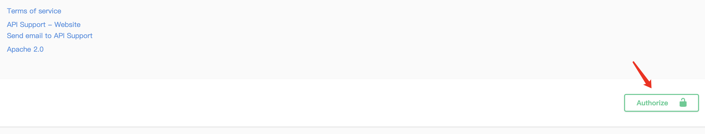

本文主要记录了如何在 Go 中使用 swaggo 根据注释自动生成 API 文档，以及如何使用条件编译来降低二进制文件大小。


<!--more-->

> 之前也用过其他的API文档工具，但是最大的问题还是文档和代码是分离的。总是出现文档和代码不同步的情况。

于是最终采用的 swaggo，根据注释自动生成 API 文档，注释即文档。


## 1. 概述

### 关于Swaggo

或许你使用过 Swagger, 而 [swaggo ](https://github.com/swaggo/swag)就是代替了你手动编写 yaml 的部分。只要通过一个命令

就可以将注释转换成文档，这让我们可以更加专注于代码。


### 接入流程

接入流程主要分为以下几个步骤：

* 0）main 文件中添加注释-配置Server，服务信息
* 1）controller 中添加注释-配置接口，接口信息
* 2）swag init 生成 docs 目录
* 3）配置 handler 访问
* 4）访问测试


## 2. 演示

以 gin 框架为例，演示一下具体操作流程。


> 完整 Demo 见 [Github][github]


### 配置服务信息

main.go 中引入以下两个包：

```go
import "github.com/swaggo/gin-swagger" // gin-swagger middleware
import "github.com/swaggo/files" // swagger embed files
```

并在 main 方法上添加以下注释描述 server：

> 具体可以添加哪些注释参考 [通用API信息](https://github.com/swaggo/swag/blob/master/README_zh-CN.md#%E9%80%9A%E7%94%A8api%E4%BF%A1%E6%81%AF)

```go
// 添加注释以描述 server 信息
// @title           Swagger Example API
// @version         1.0
// @description     This is a sample server celler server.
// @termsOfService  http://swagger.io/terms/

// @contact.name   API Support
// @contact.url    http://www.swagger.io/support
// @contact.email  support@swagger.io

// @license.name  Apache 2.0
// @license.url   http://www.apache.org/licenses/LICENSE-2.0.html

// @host      localhost:8080
// @BasePath  /api/v1

// @securityDefinitions.basic  BasicAuth
func main() {
    r := gin.Default()
    c := controller.NewController()
    v1 := r.Group("/api/v1")
    {
        accounts := v1.Group("/accounts")
        {
            accounts.GET(":id", c.ShowAccount)
        }
    //...
    }
    r.Run(":8080")
}
//...

```


### 配置接口文档

在每个接口的 controller 上添加注释以描述接口，就像下面这样：

> 具体可以添加哪些注释参考 [API操作](https://github.com/swaggo/swag/blob/master/README_zh-CN.md#api%E6%93%8D%E4%BD%9C)

```go
// ShowAccount godoc
// @Summary      Show an account
// @Description  get string by ID
// @Tags         accounts
// @Accept       json
// @Produce      json
// @Param        id   path      int  true  "Account ID"
// @Success      200  {object}  model.Account
// @Failure      400  {object}  httputil.HTTPError
// @Failure      404  {object}  httputil.HTTPError
// @Failure      500  {object}  httputil.HTTPError
// @Router       /accounts/{id} [get]
func (c *Controller) ShowAccount(ctx *gin.Context) {
  id := ctx.Param("id")
  aid, err := strconv.Atoi(id)
  if err != nil {
    httputil.NewError(ctx, http.StatusBadRequest, err)
    return
  }
  account, err := model.AccountOne(aid)
  if err != nil {
    httputil.NewError(ctx, http.StatusNotFound, err)
    return
  }
  ctx.JSON(http.StatusOK, account)
}
```


### swag init

需要先安装 swag，使用如下命令下载swag：

```shell
$ go get -u github.com/swaggo/swag/cmd/swag

# 1.16 及以上版本
$ go install github.com/swaggo/swag/cmd/swag@latest
```

在包含`main.go`文件的项目根目录运行`swag init`。这将会解析注释并生成需要的文件（`docs`文件夹和`docs/docs.go`）。

```shell
swag init
```

注：`swag init` 默认会找当前目录下的 main.go 文件，如果不叫 main.go 也可以手动指定文件位置。

```shell
# -o 指定输出目录。
swag init -g cmd/api/api.go -o cmd/api/docs
```

需要注意的是：swag init 的时候需要在项目根目录下执行，否则无法检测到所有文件中的注释。

> 比如在 /xxx 目录下执行 swag init 就只能检测到 xxx 目录下的，如果还有和 xxx 目录同级或者更上层的目录中的代码都检测不到。

init 之后会生成一个 docs 文件夹，这里面就是接口描述文件，生成后还需要将其导入到 main.go 中。

**在 main.go 中导入刚才生成的 docs 包**

**在 main.go 中导入刚才生成的 docs 包**

**在 main.go 中导入刚才生成的 docs 包**

> 重要的事情说三遍

加上之前导入的 gin-swag 相关的两个包，一共新导入了三个包。

```go
_ "xx/cmd/api/docs" // main 文件中导入 docs 包

ginSwagger "github.com/swaggo/gin-swagger"
"github.com/swaggo/gin-swagger/swaggerFiles"
```


### 配置文档handler

最后则是在 router 中增加 swagger 的 handler 了。

在 main.go 或其他地方增加一个 handler.

```go
engine := gin.New()
engine.GET("swagger/*any", ginSwagger.WrapHandler(swaggerFiles.Handler))
```


### 访问测试

项目运行起来后访问`ip:port/swagger/index.html` 即可看到 API 文档。

> 如果注释有更新，需要重新生成 docs 并重启服务才会生效。


## 3. 注释语法

具体语法见 [官方文档](https://github.com/swaggo/swag/blob/master/README_zh-CN.md)，这里主要列出几个特殊的点。

Controller 注释支持很多字段，这里主要记录常用的。

* **tags**：给 API 按照 tag 分组，便于管理。

* **accept、produce**：API 接收和响应的 MMIE 类型。

* **param**：接口请求参数，重要
    * Syntax：`param name`,`param type`,`data type`,`is mandatory?`,`comment` `attribute(optional)`
* **response、success、failure**：API 响应内容，如果成功失败返回值不一样也可以通过 success、failure 分别描述。
    * Syntax：`return code`,`{param type}`,`data type`,`comment`
* **header**：响应头
    * Syntax： `return code`,`{param type}`,`data type`,`comment`
* **router**：接口路由
    * Syntax：`path`,`[httpMethod]`


主要详细记录一下 param 和 response 该怎么写。

### param

语法：`param name`,`param type`,`data type`,`is mandatory?`,`comment` `attribute(optional)`

**参数类型**：

- query
- path
- header
- body
- formData

**数据类型**：

- string (string)
- integer (int, uint, uint32, uint64)
- number (float32)
- boolean (bool)
- user defined struct


**示例**

```go
// @Param        Authorization  header  string                     true  "JWT"
// @Param        req            body    listModel                  true  "相关信息"
// @Param        amount         query    string  				    true  "订单金额(元)"
type listModel struct {
	AnswerId string `form:"answerId"`
	Page     int    `form:"page"`
}
```

以上示例就用到了 3 种参数：

* header 中的 Authorization
* body 中的 listModel
* queryString 中的 amount

由于是可以用结构体的，所以一般都建议使用结构体，这样比较简洁。


### resp

语法：`return code`,`{param type}`,`data type`,`comment`

返回值类型和数据类型和 param 都是一致的。

示例：

```go
// @Success      200  {object}  respmodel.WxPayMp
// @Failure      400  {object}  srv.Result
```

由于成功失败返回结构不同，所以分别处理。如果相同就直接用 response 即可。


不过大部分项目中应该会定义一个通用返回结构，比如这样的：

```go
type Result struct {
	Code int         `json:"code"`
	Data interface{} `json:"data"`
	Msg  string      `json:"msg"`
}
```

不同的接口，只需要替换里面的 Data 字段即可。

> 对于这种情况，如果每次都指定返回值是 Result 结构，就无法看到具体的响应了。但是肯定也不可能为每个接口重新生成一个对应的返回结构。

好在 swaggo 提供了 [响应对象中的模型组合](https://github.com/swaggo/swag/blob/master/README_zh-CN.md#%E5%93%8D%E5%BA%94%E5%AF%B9%E8%B1%A1%E4%B8%AD%E7%9A%84%E6%A8%A1%E5%9E%8B%E7%BB%84%E5%90%88)，可以自行组合结构体，以处理这种通用返回结果的情况。

> 对于固定返回结构来说这个就很方便，可以为每个接口指定对应的 data 字段内容。

具体如下：

```go
// JSONResult的data字段类型将被proto.Order类型替换
// @success 200 {object} jsonresult.JSONResult{data=proto.Order} "desc"
type JSONResult struct {
Code    int          `json:"code" `
Message string       `json:"message"`
Data    interface{}  `json:"data"`
}

type Order struct { //in `proto` package
...
}

```

还支持对象数组和原始类型作为嵌套响应

```go
// @success 200 {object} jsonresult.JSONResult{data=[]proto.Order} "desc"
// @success 200 {object} jsonresult.JSONResult{data=string} "desc"
// @success 200 {object} jsonresult.JSONResult{data=[]string} "desc"
```

替换多个字段的类型。如果某字段不存在，将添加该字段。

```go
// @success 200 {object} jsonresult.JSONResult{data1=string,data2=[]string,data3=proto.Order,data4=[]proto.Order} "desc"
```


对于上面的情况就可以这样处理了：

```go
// @Success      200  {object}  srv.Result{data=respmodel.WxPayMp}
// @Failure      400  {object}  srv.Result
```

对于不同的接口，只需要替换其中的 data 字段即可。


## 4. FAQ

### 无法解析外部依赖

就是在项目引入了另外一个独立项目的数据结构体，在接口上配置

```go
// @Success 200 {object} ginfw.BaseHttpResponse
```

发现 swag init 无法正常生成想要的 swagger yaml 文件。  swag init 命令执行错误 cannot find type definition

**解决方案**

增加`--parseDependency --parseInternal `两个参数同时在`main.go` 中导入我们依赖的包。

> swag init --parseInternal depends on --parseDependency


注：因为依赖的是外部包的内部结构,导致无法扫描到，同理，直接引入 go 内置的包也无法直接解析，也是需要这样处理一下。


### 无法引入内部依赖

**有时候一个项目里依赖也无法解析**:

```go
// @Success      200  {object}  srv.Result{data=respmodel.AnswerItem}
```

swag init 时报错：

```c
cannot find type definition: respmodel.AnswerItem
```

尝试了`--parseInternal depends on --parseDependency`也没有效果，最后发现：

**这个是因为同一个包里面定义了几个重名的结构体导致的，改名即可解决问题。**

> 比如这里是在 user 的 respmodel 中定义了 AnswerItem，然后在 admin 的 respmodel 中也定义了 AnswerItem，二者结构不同只是名字相同。
>
> 因为几个项目是在一个仓库里，导致初始化时不知道用哪个了。


### 构建速度

在添加了`--parseDependency` 后生成速度明显减低，此时可以添加`--parseDepth` 参数指定数据结构深度来加快生成速度。

相关参数含义如下：

| 参数名          | 含义解释                      |
| --------------- | ----------------------------- |
| parseInternal   | 解析内部依赖包，默认值: false |
| parseDependency | 解析外部依赖包，默认值: false |
| parseDepth      | 解析依赖包深度，默认值:100    |

注：parseDepth 这个参数非常有用，如果你知道需要解析的数据结构深度，建议使用这个参数，swag 命令执行时间会大大缩短。


## 5. 优化

### swag fmt

swaggo 提供了 swag fmt 工具，可以针对Swag的注释自动格式化，就像`go fmt`，让注释看起来更统一。

示例：

```
swag fmt
```

排除目录（不扫描）示例：

```
swag fmt -d ./ --exclude ./internal
```

指定 `main.go` 文件示例：

```shell
swag fmt -g cmd/api/api.go
```


### 条件编译

swaggo 是直接 build 到二进制里的，会极大增加二进制文件的大小，一般在生产环境不需要将 docs 编译进去。

可以利用 go 提供的条件编译来实现是否编译文档。


在`main.go`声明`swagHandler`,并在该参数不为空时才加入路由：

```go
package main

//...

var swagHandler gin.HandlerFunc

func main(){
    // ...
    
    	if swagHandler != nil {
			r.GET("/swagger/*any", swagHandler)
        }
    
    //...
}
```

同时,我们将该参数在另外加了`build tag`的包中初始化。

> 条件编译只需要在对应文件首行加入 go:build xxx 即可，这样只有编译时指定 xxx tag 才会把该文件编译进去。

```go
//go:build doc

package main

import (
    ginSwagger "github.com/swaggo/gin-swagger"
    "github.com/swaggo/gin-swagger/swaggerFiles"
    _ "i-go/gin/swagger/docs"
)

func init() {
    swagHandler = ginSwagger.WrapHandler(swaggerFiles.Handler)
}

```

之后我们就可以使用`go build -tags "doc"`来打包带文档的包，直接`go build`来打包不带文档的包。

> 注：go 1.16 之前旧版条件编译语法为 //+build 1.16之后增加了新版语法 go:build

> 完整 Demo 见 [Github][github]


[github]:https://github.com/lixd/i-go/tree/master/gin/swagger

## 7. 添加鉴权
1、在main函数中增加全局配置，其中@name就是你确定的鉴权参数名，我的是 X-Auth-Token,    @in header 说明参数放在header，你的鉴权代码需要从header中获取
```go
// @title gin-blog API
// @version 0.0.1
// @description This is a gin blog example
// @securityDefinitions.apikey ApiKeyAuth
// @in header
// @name X-Auth-Token
// @BasePath /
```
主要是添加了下面这三行
```go
// @securityDefinitions.apikey ApiKeyAuth
// @in header
// @name X-Auth-Token
```
第一行指定 apikey
第二行表示参数填在 header 里
第三行为具体的参数名，需要注意的是只能有一个 name，填多个只有最后一个会生效。
2.在具体的handler里添加如下注释，此处的ApiKeyAuth和main中的apike对应，切记不要修改
```go
// @Security ApiKeyAuth
```
添加这行注释即表名这条 api 需要用指定 apikey 对应的认证方式进行认证。

3. 使用时添加对应鉴权参数即可,添加 token 后，后续所有有鉴权接口的 header 里自动携带 token


如果不同接口有不同认证方式，只需要定义多个 apikey 即可，就像这样
```go
// @securityDefinitions.apikey ApiKeyAuth1
// @in header
// @name X-Auth-Token

// @securityDefinitions.apikey ApiKeyAuth2
// @in header
// @name X-Auth-Token2
```
对应 Handler 选择不同 apikey 即可实现
```go
// @Security ApiKeyAuth
func hander1(){}

// @Security ApiKeyAuth2
func hander2(){}
```
