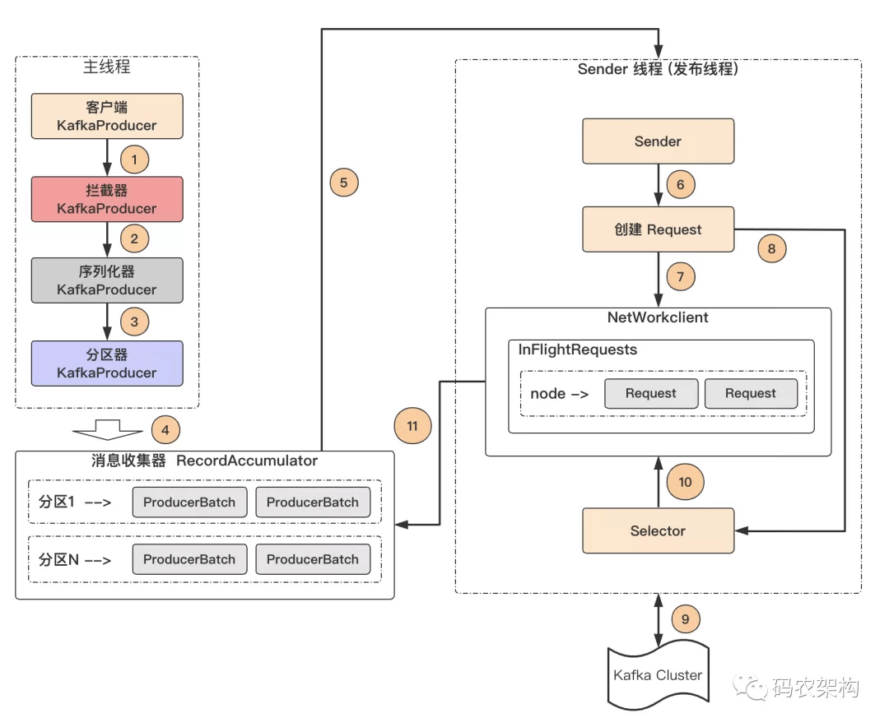

0. Kafka的用途有哪些？使用场景如何？
   削峰填谷
0. Kafka中的ISR、AR又代表什么？ISR的伸缩又指什么
   消息会先发送到leader副本，然后follower副本才能从leader副本中拉取消息进行同步，同步期间内follower副本相对于leader副本而言会有一定程度的滞后。前面所说的“一定程度”是指可以忍受的滞后范围，这个范围可以通过参数进行配置。
   分区中的所有副本统称为AR（Assigned Repllicas）。所有与leader副本保持一定程度同步的副本（包括Leader）组成ISR（In-Sync Replicas），ISR集合是AR集合中的一个子集。
   与leader副本同步滞后过多的副本（不包括leader）副本，组成OSR(Out-Sync Relipcas),由此可见：AR=ISR+OSR。在正常情况下，所有的follower副本都应该与leader副本保持一定程度的同步，即AR=ISR,OSR集合为空。
   Leader副本负责维护和跟踪ISR集合中所有的follower副本的滞后状态，当follower副本落后太多或者失效时，leader副本会吧它从ISR集合中剔除。如果OSR集合中follower副本“追上”了Leader副本，则会加入到 ISR集合。之后再ISR集合中的副本才有资格被选举为leader，而在OSR集合中的副本则没有机会（这个原则可以通过修改对应的参数配置来改变）
   https://blog.csdn.net/weixin_43975220/article/details/93190906
   
0. Kafka中的HW、LEO、LSO、LW等分别代表什么？
   HW(High Watermark)俗称高水位，它标识了一个特定的消息偏移量（offset），消费者只能拉取到这个offset之前的消息。
   LW(Low Watermark),俗称低水位, 代表 AR 集合中最小的 logStartOffset,AR（Assigned Repllicas）为分区中的所有副本统称。
   LEO(Log End Offset),标识当前日志文件中下一条待写入的消息的offset。分区 ISR 集合中的每个副本都会维护自身的 LEO ，而 ISR 集合中最小的 LEO 即为分区的 HW，对消费者而言只能消费 HW 之前的消息。
   LSO(LastStableOffset),它具体与kafka的事物有关。消费端参数——isolation.level,这个参数用来配置消费者事务的隔离级别。字符串类型，“read_uncommitted”和“read_committed”，表示消费者所消费到的位置，如果设置为“read_committed"，那么消费这就会忽略事务未提交的消息，既只能消费到LSO(LastStableOffset)的位置，默认情况下，”read_uncommitted",既可以消费到HW（High Watermak）的位置。
   
0. Kafka中是怎么体现消息顺序性的？
   Kafka只能保证分区内消息顺序有序，无法保证全局有序
   生产者：通过分区的leader副本负责数据顺序写入，来保证消息顺序性
   消费者：同一个分区内的消息只能被一个group里的一个消费者消费，保证分区内消费有序
   用kafka采集用户访问 轨迹，重写分区器把用户id作为分区键，这样每个用户访问的埋点记录就能按顺序到一个分区，然后有序消费

0. Kafka中的分区器、序列化器、拦截器是否了解？它们之间的处理顺序是什么？
   拦截器->序列化器->分区器
   序列化器的作用是在进行网络传输中将数据序列化为字节流进行传输，保证数据不会丢失，
   拦截器主要用于client的定制化控制逻辑 生产者拦截器可以用在消息发送前做一些准备工作
   分区器的作用是根据消息的Key按照一定算法分配到各个分区。kafka本身有自己的分区策略，如果未指定，则采用默认的分区策略。
   kafka默认的分区策略是根据key进行分区的分配，即hash(key) % numPartitions, numPartitions:分区数量，如果key相同，则被分配到同一个分区。
   一般采用默认的分区器即可
0. Kafka生产者客户端的整体结构是什么样子的？
  
   
0. Kafka生产者客户端中使用了几个线程来处理？分别是什么？
   整个生产者客户端由两个线程协调运行，这两个线程分别为主线程和发送线程。在主线程中由 KafkaProducer 创建消息，然后通过可能的拦截器、序列化器和分区器的作用之后缓存到消息收集器（RecordAccumulator，也称为消息累加器）中。发送线程负责从消息收集器中获取消息并将其发送到 Kafka 中。
   主要用来缓存消息以便发送线程可以批量发送，进而减少网络传输的资源消耗以提升性能
0. Kafka的旧版Scala的消费者客户端的设计有什么缺陷？
   过度依赖Zookeeper
0. “消费组中的消费者个数如果超过topic的分区，那么就会有消费者消费不到数据”这句话是否正确？如果正确，那么有没有什么hack的手段？
   不正确，通过自定义分区分配策略，可以将一个consumer指定消费所有partition。
0. 消费者提交消费位移时提交的是当前消费到的最新消息的offset还是offset+1?
   offset+1
0. 有哪些情形会造成重复消费？
   
README https://blog.csdn.net/weixin_39703551/article/details/111262588

0. 那些情景下会造成消息漏消费？
0. KafkaConsumer是非线程安全的，那么怎么样实现多线程消费？
0. 简述消费者与消费组之间的关系
0. 当你使用kafka-topics.sh创建（删除）了一个topic之后，Kafka背后会执行什么逻辑？
0. topic的分区数可不可以增加？如果可以怎么增加？如果不可以，那又是为什么？
0. topic的分区数可不可以减少？如果可以怎么减少？如果不可以，那又是为什么？
0. 创建topic时如何选择合适的分区数？
0. Kafka目前有那些内部topic，它们都有什么特征？各自的作用又是什么？
0. 优先副本是什么？它有什么特殊的作用？
0. Kafka有哪几处地方有分区分配的概念？简述大致的过程及原理
0. 简述Kafka的日志目录结构
0. Kafka中有那些索引文件？
0. 如果我指定了一个offset，Kafka怎么查找到对应的消息？
0. 如果我指定了一个timestamp，Kafka怎么查找到对应的消息？
0. 聊一聊你对Kafka的Log Retention的理解
0. 聊一聊你对Kafka的Log Compaction的理解
0. 聊一聊你对Kafka底层存储的理解（页缓存、内核层、块层、设备层）
0. 聊一聊Kafka的延时操作的原理
0. 聊一聊Kafka控制器的作用
0. 消费再均衡的原理是什么？（提示：消费者协调器和消费组协调器）
0. Kafka中的幂等是怎么实现的
0. Kafka中的事务是怎么实现的（这题我去面试6加被问4次，照着答案念也要念十几分钟，面试官简直凑不要脸）
0. Kafka中有那些地方需要选举？这些地方的选举策略又有哪些？
0. 失效副本是指什么？有那些应对措施？
0. 多副本下，各个副本中的HW和LEO的演变过程
0. 为什么Kafka不支持读写分离？
0. Kafka在可靠性方面做了哪些改进？（HW， LeaderEpoch）
0. Kafka中怎么实现死信队列和重试队列？
0. Kafka中的延迟队列怎么实现（这题被问的比事务那题还要多！！！听说你会Kafka，那你说说延迟队列怎么实现？）
0. Kafka中怎么做消息审计？
0. Kafka中怎么做消息轨迹？
0. Kafka中有那些配置参数比较有意思？聊一聊你的看法
0. Kafka中有那些命名比较有意思？聊一聊你的看法
0. Kafka有哪些指标需要着重关注？
0. 怎么计算Lag？(注意read_uncommitted和read_committed状态下的不同)
0. Kafka的那些设计让它有如此高的性能？
0. Kafka有什么优缺点？
0. 还用过什么同质类的其它产品，与Kafka相比有什么优缺点？
0. 为什么选择Kafka?
0. 在使用Kafka的过程中遇到过什么困难？怎么解决的？
0. 怎么样才能确保Kafka极大程度上的可靠性？
0. 聊一聊你对Kafka生态的理解